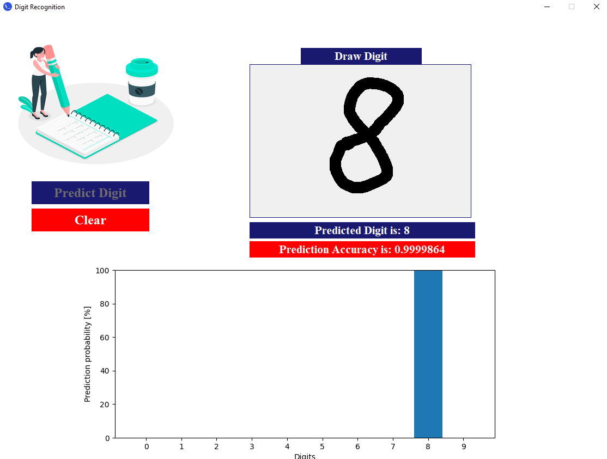

The application was created in order to practically learn how neural networks work. 
Using the tensorflow library, the effectiveness of traditional and convolutional neural networks was tested in the task of recognizing handwritten digits.
In addition, various architects and parameters of the networks used were tested.

In order to visualize the results, a simple application was created with the option of drawing your own numbers and showing the prediction graph:

